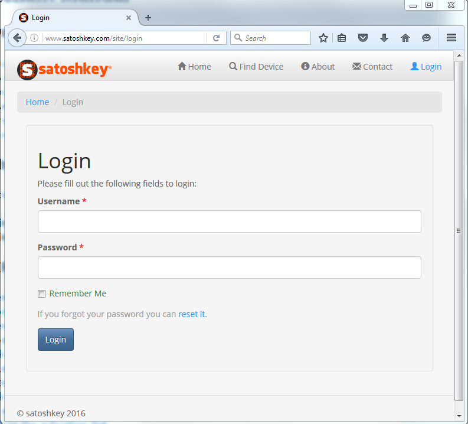
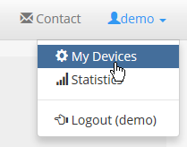
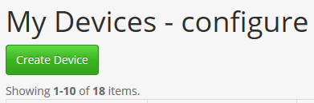
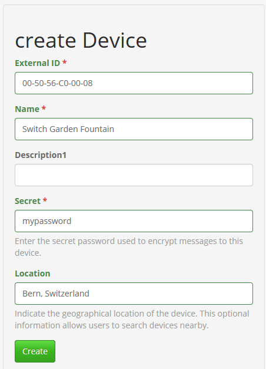

.. satoshkey documentation master file, created by
   sphinx-quickstart on Wed Jan 07 21:34:54 2015.
   You can adapt this file completely to your liking, but it should at least
   contain the root `toctree` directive.

Merchant Manual 
***************
 
Activate Everything !
=====================
 
Congratulations on purchasing your Satoshkey Universal Digital Currency Switch ! It has been carefully constructed and tested in Switzerland. Please read this manual carefully. It 
will help you make the most of your Satoshkey Switch. Most problems you may encounter will be minor and the manual will provide an answer. Please feel free
to contact us if you have unanswered questions relating to operation or maintenance. Also, if you have technical questions to expanding the functions
of your Satoshkey Switch, we would be most happy to help. 
 
Step by Step instructions for registration and setup
----------------------------------------------------
 
User Registration:
------------------

* Open your browser and navigate to `satoshkey.com <http://www.satoshkey.com>`_
* Open the field "Registration"
* Choose a username
* Click "Generate a password", confirm with "o.k."
* Enter your email-address
* Click "Submit"
* You will receive an email "email address verification"
* Click on the activation-link
* A new window opens in the browser

Registration of a Satoshkey Switch:
-----------------------------------

* Login with your username and password

* Click [Username]
* Click "My Devices"

* Click "Create Device"

* Fill the fields to configure your switch

* External Id = MAC-Address, every Satoshkey Switch holds a individual code on the backside. Enter this address in the field.
* Name = Choose your own name for this particular Satoshkey Switch. 
* Payment-Address = Bitcoin-address where you are controlling the private-key. 
* Secret = Enter some random password, used to encrypt the message in the programming sequence.

* Optionally enter the location of the Satoshkey Switch: Enter the exact location. The service can then be found by "find device" on the `satoshkey.com <http://www.satoshkey.com/device/index>`_ website
* Click "Create"

Programming of a Satoshkey Switch:
----------------------------------

* Open "My Devices - configure"
* The Satoshkey Switch is now ready to accept instructions. 
    
Configuration of a Satoshkey Switch
-----------------------------------

* Open "My Devices-configure" 
* Click "instructions"
* "Instructions Test" is displayed
* Click "create instruction"
* Choose a template and customize the parameters P1 - P5 according to your needs
* Select an instruction type
* Choose a category

 * Switch **ON**        : Output (number 1 or 2) will switch ON for X seconds   
 * Switch **OFF**       : Output (number 1 or 2) will switch OFF for X seconds  
 * **O1** **ON** **WAIT** **O2** **ON** : Output number 1 will switch ON for X seconds - wait time for X seconds - output number 2 will switch ON for X seconds
 
* Name = Name of service
* Description = Any desired additional information 
* Currency = Choose currency
* Price  = Price in selected currency for 1 x run
* No Of Days Valid = Days until expiration
* No Of Runs Valid = Number of runs for the indicated price   
* Click "create" 

 

 

