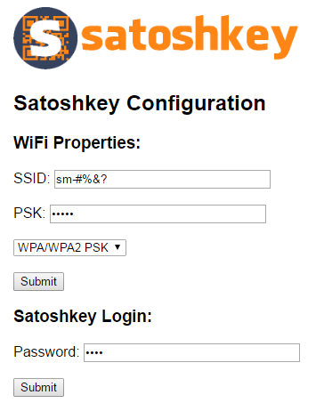
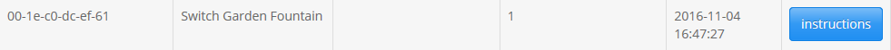
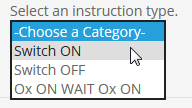
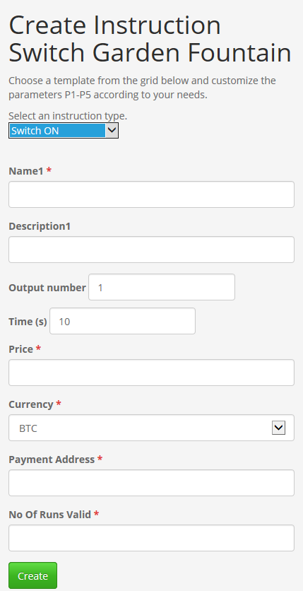
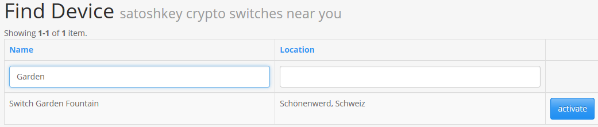
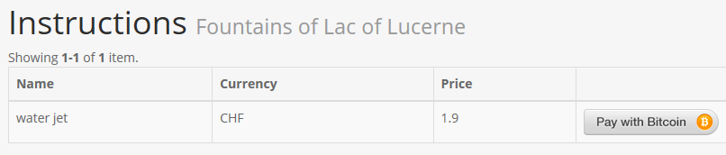
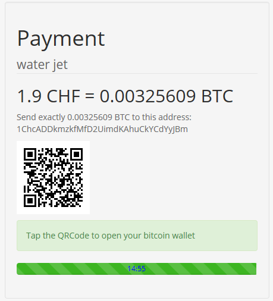
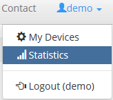
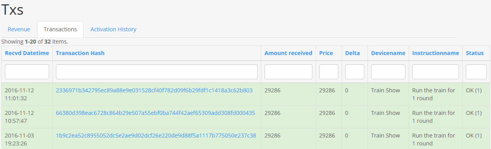

.. satoshkey documentation master file, created by
   sphinx-quickstart on Wed Jan 07 21:34:54 2015.
   You can adapt this file completely to your liking, but it should at least
   contain the root `toctree` directive.

User Manual 
************
 
Congratulations on purchasing your satoshkey Universal Digital Currency Switch ! It has been carefully constructed and tested in Switzerland. Please read this manual carefully. It 
will help you make the most of your satoshkey switch. Most problems you may encounter will be minor and the manual will provide an answer. Please feel free
to contact us if you have unanswered questions relating to operation or maintenance. Also, if you have technical questions to expanding the functions
of your satoshkey switch, we would be most happy to help. 
 
Registration and setup
======================

Setting up the satoshkey switch
-------------------------------
After powering on, you can connect to the satoshkey switch using WiFi.
Connect to the network with SSID: SATOSHKEY.
Navigate your browser to 192.168.1.1

* SSID: The identifier of the WiFi network you want the satoshkey switch to connect to. If you intend to connect the satoshkey switch only via Ethernet cable you can leave this empty.
* PSK: The password used to connect to the Wifi network. If you intend to connect the satoshkey switch only via Ethernet cable you can leave this empty.	
* Password: Enter a passwort that is used to exchange messages with this satoshkey switch.

Registering the satoshkey switch 
---------------------------------

* Navigte to www.satoshkey.com and register an account.
* Login with your username and password.

.. image:: ../images/browserLogin.png

* Click [Username]
* Click "My Devices"

.. image:: ../images/myDevices.png

* Click "Create Device"

.. image:: ../images/createDevice.png

* Fill in the fields to configure your switch

.. image:: ../images/newDeviceForm.png

* External Id: The MAC-Address of your satoshkey switch. This address is displayed on the back of your device.
* Name: The name of the satoshkey switch.
* Description: The description for the satoshkey switch.
* Secret = A password to secure the communication to your satoshkey switch.

* Optionally enter the location of the satoshkey switch: Enter the exact location. The service can then be found by "find device" on the `satoshkey.com <http://www.satoshkey.com/device/index>`_ website
* Click "Create"
    
Defining Instructions
---------------------
An instruction is a switching sequence with an associated price and bitcoin address for receiving payments.

* Click the "instructions" button 

* Choose the instruction type

	* Switch **ON**        : Output (number 1 or 2) will switch ON for X seconds   
	* Switch **OFF**       : Output (number 1 or 2) will switch OFF for X seconds  
	* **O1** **ON** **WAIT** **O2** **ON** : Output number 1 will switch ON for X seconds - wait time for X seconds - output number 2 will switch ON for X seconds
	
* Fill in the fields to define an instruction

 
* Name = Name of the instruction
* Description = Description of the instruction
* Price  = The price in the selected currency
* Currency = The currency used to display the price
* Payment Address = The bitcoin address to receive payments for this instruction.
* No Of Runs Valid = Number of runs for the indicated price. The default value of 1 is recommended.

* Click "create" 

Activating the switch
=====================
The satoshkey switch is activated once a payment to a bitcoin address configured for an instruction is received.
In order to list instructions defined on a particular switch, use the "Find Device" button.

* Click "Find Device" and use the filter to find the satoshkey switch you intend to activated
* Click the "activate" button

All instructions defined on the selected satoshkey switch are listed.

* Click on the "pay" with bitcoin button next to the instruction you want to activate

* Scan the barcode displayed and pay to the displayed address

Note the progress bar displayed below the QR code. If a currency different from BTC is configured, satoshkey calculates the price in the configured currency.
The progress bar illustrates the period during which the displayed price is valid. After the time elapses, the price is recalculated. This is due to exchange rate volatility.

Statistics
==========
In the statistics section of the satoshkey web portal you can retrieve several statistics.

* Log in to www.satoshkey.com
* Click the "statistics" menu entry

Transactions
------------
The transactions history provides an overview about every transaction that appeared on satoshkey switches registered with your account.
Different color codes illustrate the result of the transaction. The "delta" displays the difference between the configured price (calculated to BTC) for the instruction and the effective payment.
Transaction for which this delta is not 0 are marked as under or over-payments.

 

 

