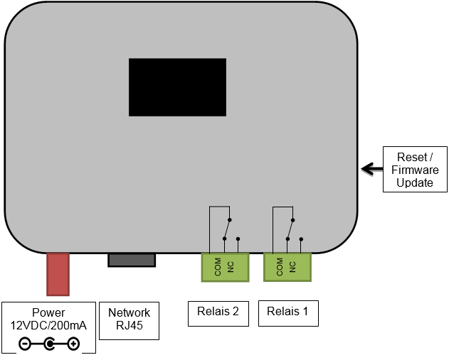

.. satoshkey documentation master file, created by
   sphinx-quickstart on Wed Jan 07 21:34:54 2015.
   You can adapt this file completely to your liking, but it should at least
   contain the root `toctree` directive.

Technical Manual
=====================================

Firmware Update
---------------
Download the latest firmware for your device at www.satoshkey.com/firmware.
Follow the steps described below.

* Unplug the power connector
* Press the reset button and hold it
* Plug the power connector back in
* Release the reset button after 2 seconds
* The display shows FIRMWARE UPLOAD and the MAC address
* Connect to the SATOSHKEY WiFi Network (if you are already connected, disconnect and reconnect)
* The webbrowser will open automatically. Navigate to 192.168.1.1.
* Upload the file for the new firmware
* The switch reboots with the new firmware
* Repeat the process if an error should occur in any of the steps described above

Schematic
---------
The following picture illustrates the schematic.
