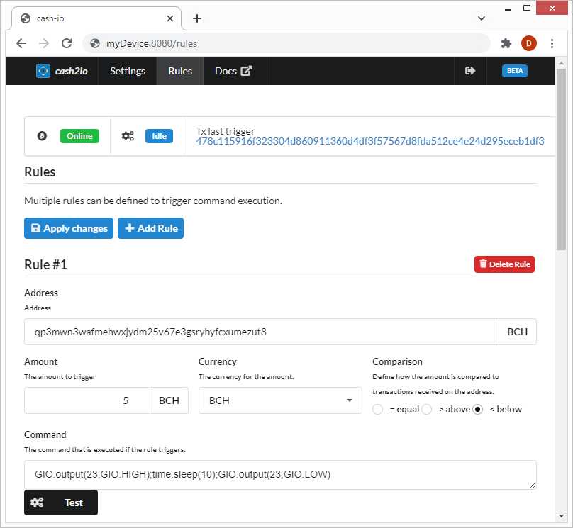

.. satoshkey documentation master file, created by
   sphinx-quickstart on Wed Jan 07 21:34:54 2015.
   You can adapt this file completely to your liking, but it should at least
   contain the root `toctree` directive.

User Manual 
************
 
Setup
======================

Installation
-------------------------------
Pip install cash2io.

Settings
---------------------------------
    
Rules
---------------------

* Define rules